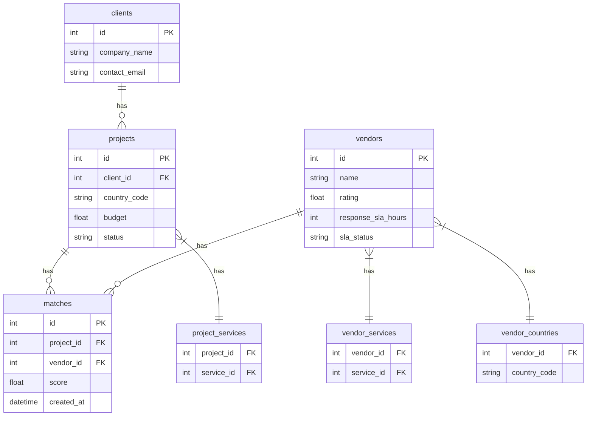

# Expander360 - Vendor Matching Platform

A NestJS-based platfom that matches expansion projects with qualified vendors across different countries.

Live Demo: [Coming Soon - Railway Deployment]

## 🔧 Setup & Installation

### Using Docker (Recommended)
1. Clone the repository:
```bash
git clone https://github.com/Mohamedaboda-bit/expanders360_task.git
cd app
```

2. Create .env file:
```bash
cp .env.example .env
```

3. Start with Docker:
```bash
docker-compose up -d
```

That's it! Docker will handle migrations and seeding automatically.

### Local Development
1. Prerequisites:
   - Node.js 18+
   - MySQL 8.0+
   - MongoDB 6.0+

2. Install dependencies:
```bash
npm install
```

3. Create and configure .env file:
```bash
cp .env.example .env
# Edit .env file with your local database credentials
```

4. Run migrations and seeds:
```bash
npm run migration:run
npm run seed
```

5. Start the application:
```bash
npm run start:dev
```

## 📊 Database Schema



The platform uses a dual-database architecture:
- **MySQL**: For core business data and relationships
- **MongoDB**: For document storage and full-text search capabilities

## � Setup & Installation

1. Clone the repository:
```bash
git clone https://github.com/Mohamedaboda-bit/expanders360_task.git
cd app
```

2. Create .env file:
```bash
cp .env.example .env
```

3. Start with Docker:
```bash
docker-compose up -d
```

4. Run migrations and seeders:
```bash
docker-compose exec app npm run migration:run
docker-compose exec app npm run seed
```


- NestJS (TypeScript)
- MySQL with TypeORM
- MongoDB with Mongoose
- JWT Authentication
- Docker & Docker Compose
- Node.js Email Service
- NestJS Schedule

### User Roles
- **Client**: Can manage their own projects and view matches
- **Admin**: Full access to all resources and analytics

### JWT Configuration
- **Secret**: Configured via `JWT_SECRET` environment variable
- **Expiration**: Default 24 hours, configurable via `JWT_EXPIRES_IN`
- **Algorithm**: HS256 (HMAC SHA-256)

```


### Authentication & Authorization
- JWT-based authentication
- Role-based access control (Client, Admin)
- Protected routes with Guards

### Smart Vendor Matching
- Automated match generation
- Intelligent scoring: `services_overlap * 2 + rating + SLA_weight`
- Geographic compatibility checks
- Service type alignment
- SLA status verification

### Project & Document Management
- Complete project lifecycle management
- Document upload and organization
- Tag-based search
- Full MongoDB integration

### Analytics & Monitoring
- Real-time vendor performance metrics
- Match score analysis
- Document tracking
- Automated notifications

## 🚀 API Documentation

Full API documentation with examples and request/response schemas is available in our [Postman Collection](https://documenter.getpostman.com/view/22818117/2sB3BLk8CL)

Key endpoints include:
- Authentication (register/login)
- Projects management
- Vendor matching
- Document handling
- Analytics

### Projects (Protected)
- `GET /projects` - List projects (Client sees own, Admin sees all)
- `GET /projects/:id` - Get project details (Owner/Admin)
- `POST /projects` - Create project (Client only)
- `PATCH /projects/:id` - Update project (Owner/Admin)
- `DELETE /projects/:id` - Delete project (Owner/Admin)
- `POST /projects/:id/matches/rebuild` - Rebuild vendor matches

### Vendors (Protected)
- `GET /vendors` - List all vendors (Admin only)
- `GET /vendors/:id` - Get vendor details (Admin only)
- `POST /vendors` - Create vendor (Admin only)
- `PATCH /vendors/:id` - Update vendor (Admin only)
- `DELETE /vendors/:id` - Delete vendor (Admin only)

### Matches (Protected)
- `GET /matches` - List matches (Client sees own, Admin sees all)
- `GET /matches/:id` - Get match details (Owner/Admin)
- `GET /matches/project/:projectId` - Get matches for project
- `GET /matches/vendor/:vendorId` - Get matches for vendor (Admin only)
- `DELETE /matches/:id` - Delete match (Admin only)

### Analytics (Protected)
- `GET /analytics/top-vendors` - Top vendors by country (Admin only)

## 🔒 Security Features

## 🔒 Security Features

- **JWT Security**
  - Token validation & expiration
  - Role-based authorization
  - Secure token storage
- **Data Protection**
  - Bcrypt password hashing
  - SQL injection prevention
  - Input sanitization & validation
- **Access Control**
  - Client data isolation
  - Admin access management
  - Resource ownership validation

## 🧪 Testing

### API Testing Examples
```bash
# Register a new client
curl -X POST http://localhost:3000/auth/register \
  -H "Content-Type: application/json" \
  -d '{
    "email": "client@example.com",
    "password": "password123",
    "company_name": "Example Corp",
    "contact_email": "contact@example.com"
  }'

# Login and get JWT token
curl -X POST http://localhost:3000/auth/login \
  -H "Content-Type: application/json" \
  -d '{
    "email": "client@example.com",
    "password": "password123"
  }'

# Use JWT token for protected endpoints
curl -X GET http://localhost:3000/projects \
  -H "Authorization: Bearer YOUR_JWT_TOKEN"
```


## 📝 Development

### Commands
```bash
# Development
npm run start:dev      # Start with hot reload
npm run build         # Build for production
npm run start         # Start production build

# Database Management
npm run migration:run # Run migrations
npm run seed         # Run all seeders

```

### Configuration
- **Database**: Configure in `.env` file
  ```
  DB_HOST=localhost
  DB_PORT=3306
  DB_USER=your_user
  DB_PASS=your_pass
  DB_NAME=expander360
  ```
- **MongoDB**: Set connection URI
  ```
  MONGODB_URI=mongodb://localhost:27017/expander360
  ```
- **JWT**: Security settings
  ```
  JWT_SECRET=your_secret_key
  JWT_EXPIRES_IN=24h
  ```


---

**Built with ❤️ using NestJS**
