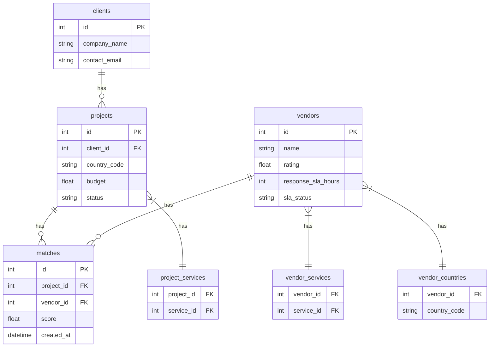

# Expander360 - Vendor Matching Platform

A NestJS-based platfom that matches expansion projects with qualified vendors across different countries.

Live Demo: [Coming Soon - Railway Deployment]

## 🔧 Setup & Installation

### Using Docker (Recommended)
1. Clone the repository:
```bash
git clone https://github.com/Mohamedaboda-bit/expanders360_task.git
cd app
```

2. Create .env file:
```bash
cp .env.example .env
```

3. Start with Docker:
```bash
docker-compose up -d
```

That's it! Docker will handle migrations and seeding automatically.

### Local Development
1. Prerequisites:
   - Node.js 18+
   - MySQL 8.0+
   - MongoDB 6.0+

2. Install dependencies:
```bash
npm install
```

3. Create and configure .env file:
```bash
cp .env.example .env
# Edit .env file with your local database credentials
```

4. Run migrations and seeds:
```bash
npm run migration:run
npm run seed
```

5. Start the application:
```bash
npm run start:dev
```

## 📊 Database Schema



The platform uses a dual-database architecture:
- **MySQL**: For core business data and relationships
- **MongoDB**: For document storage and full-text search capabilities


## 📝 Development

### Commands
```bash
# Development
npm run start:dev      # Start with hot reload
npm run build         # Build for production
npm run start         # Start production build

# Database Management
npm run migration:run # Run migrations
npm run seed         # Run all seeders

```

### Configuration
- **Database**: Configure in `.env` file
  ```
  DB_HOST=localhost
  DB_PORT=3306
  DB_USER=your_user
  DB_PASS=your_pass
  DB_NAME=expander360
  ```
- **MongoDB**: Set connection URI
  ```
  MONGODB_URI=mongodb://localhost:27017/expander360
  ```
- **JWT**: Security settings
  ```
  JWT_SECRET=your_secret_key
  JWT_EXPIRES_IN=24h
  ```


---

**Built with ❤️ using NestJS**
