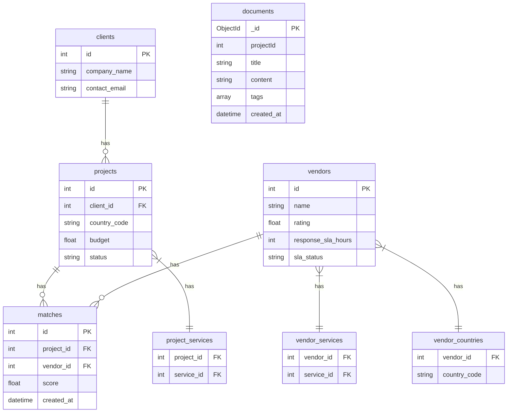

```mermaid
erDiagram
    clients ||--o{ projects : has
    projects ||--o{ matches : has
    projects }|--|| project_services : has
    vendors ||--o{ matches : has
    vendors }|--|| vendor_services : has
    vendors }|--|| vendor_countries : has
    
    clients {
        int id PK
        string company_name
        string contact_email
    }

    projects {
        int id PK
        int client_id FK
        string country_code
        float budget
        string status
    }

    project_services {
        int project_id FK
        int service_id FK
    }

    vendors {
        int id PK
        string name
        float rating
        int response_sla_hours
        string sla_status
    }

    vendor_countries {
        int vendor_id FK
        string country_code
    }

    vendor_services {
        int vendor_id FK
        int service_id FK
    }

    matches {
        int id PK
        int project_id FK
        int vendor_id FK
        float score
        datetime created_at
    }

    documents {
        ObjectId _id PK
        int projectId
        string title
        string content
        array tags
        datetime created_at
    }
```
